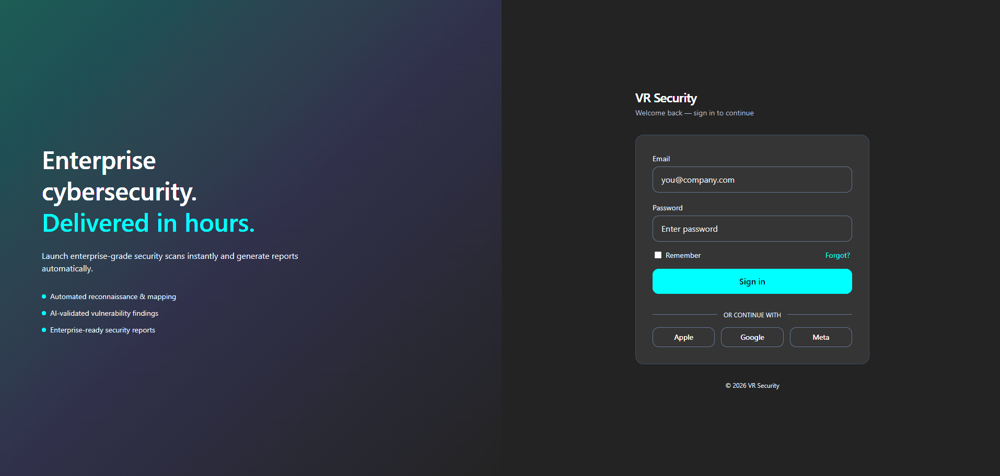
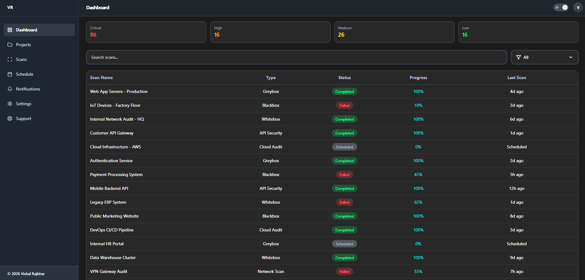
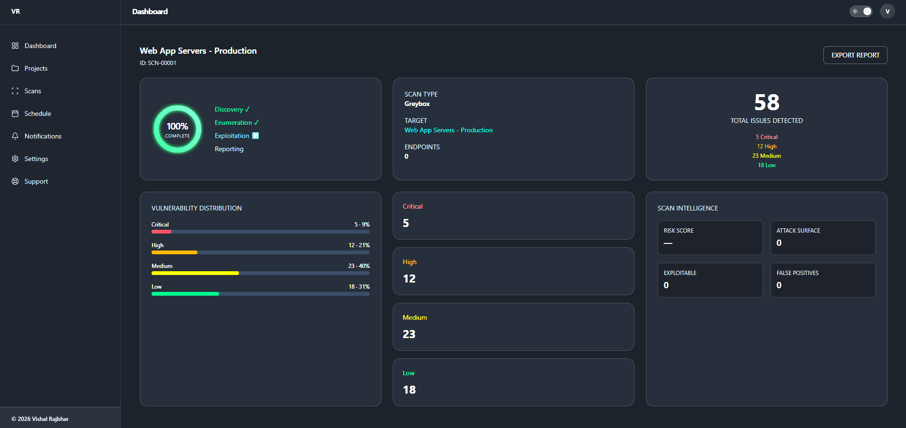

<h1 align="center">Security Dashboard</h1>

<p align="center">
A modern security monitoring dashboard built with a focus on clean UI, scalability, and real-world product design.
</p>

<p align="center">
  
  
  
  
  
</p>

---

## Overview

Security Dashboard is a fully responsive frontend application designed to simulate a real-world cybersecurity monitoring platform.

The project emphasizes modern UI architecture, scalable component design, and a polished SaaS experience. It demonstrates best practices in responsive layouts, theming, and structured component composition.

---

## Live Demo

Live Application: https://securitydashboard.vercel.app

Note: This is a UI-only demo. Authentication is not implemented - simply click “Sign In” to access the dashboard.

---

## Design Approach

The design follows modern SaaS product principles with a focus on usability and clarity.

- Mobile-first responsive layout  
- Clean and minimal interface  
- Sidebar and top navigation architecture  
- Dark mode support  
- Consistent spacing and typography  
- Smooth interaction feedback  

---

## Features

- Dashboard overview with key metrics  
- Security scan management interface  
- Detailed scan insight page  
- Responsive table (desktop) and card layout (mobile)  
- Sidebar navigation (desktop)  
- Mobile drawer navigation  
- Dark and light theme toggle  
- Search and filtering interface  
- Toast notification system  
- Smooth transitions and hover states  

---

## Technology Stack

| Category        | Technology |
|----------------|-----------|
| Frontend       | React.js |
| Styling        | Tailwind CSS v4 |
| Build Tool     | Vite |
| Routing        | React Router DOM |
| State Handling | React Hooks |
| Data Source    | Local mock data |
---
### Dropdown & UI Improvements

- Replaced text-based arrows with Lucide icons
- Added rotation animation to dropdown indicators
- Fixed JSX issues causing blank screen
- Improved dropdown interaction (state-based rotation)

---

### Code Stability Fixes

- Fixed invalid Tailwind classes
- Corrected JSX syntax errors
- Ensured consistent component rendering across breakpoints

---

### Notes

- Sidebar visibility is now handled at the layout level
- Avoid using responsive visibility classes (`hidden md:flex`) inside reusable components
---
## Login 

<p align="center">  </p>

## Dashboard
<p align="center">  </p>

## Scan Details Page

<p align="center">  </p>

---

## Installation

```bash
git clone https://github.com/vishalraj55/Dashboard
cd security-dashboard
npm install
npm run dev